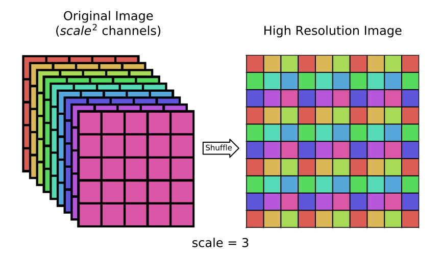

### Pixel Shuffle Layer

Pixel Shuffle layer is one of the most recent layer type introduced in modern deep learning Neural Network.
Its application is closely related to the single-image super-resolution (SISR) research, i.e the techniques ensemble which aim is to produce a high-resolution image from a single low-resolution one.

The first SISR neural networks start with a pre-processing of low-resolution image in input with a bicubic up-sample.
Then the image, with the same dimension of the desired output, feeds the model which aim to increase the resolution and fix its details.
In this way the amount of parameters and moreover the computational power required by the training section increase (by a factor equal to the square of the desired up-sample scale), despite the image processing required is smaller.
To overcome this problem a Pixel Shuffle transformation, also known as *sub-pixel convolution*, was introduced ([original paper](https://arxiv.org/abs/1609.05158)): in this work the authors prooved the equivalence between a regular transpose convolution, i.e the previous standard transformation to enlarge the input dimensions, and the sub-pixel convolution transformation without losing any information.
The Pixel Shuffle transformation reorganize the low-resolution image channels to obtain a bigger image with few channels.
An example of this transformation is shown in the image below:


*Fig: On the left the input image with scale<sup>2</sup> (= 9) channels.
On the right the result of Pixel Shuffle transformation.
Since the number of channels is a perfect square, the output is a single channel image with the rearrangement of the original ones.*

Pixel Shuffle rearranges the elements of the input tensor expressed as H * W * C<sup>2</sup> to form a scale &cdot; H \times scale \cdot W \times C$ tensor.
This can be very useful after a convolutional process, in which the number of filters drastically increase the number of channels, to *invert* the transformation like a sort of *deconvolution* function.

The main gain in using this transformation is the increment of computational efficiency in Neural Network model.
With the introduction of a Pixel Shuffle transformation in the Neural Network tail, i.e. after a sequence of small processing steps which increase the number of features, we can reorganize the set of pixels into a single bigger image, that is the desired output in a SISR application.

For a deeper understanding of the pixel shuffle layer, see [this usefull blog post](https://medium.com/@hirotoschwert/introduction-to-deep-super-resolution-c052d84ce8cf).

This is a sample code on how to use the pixel shuffle layer to perform the transformation shown above:

```python
# first the fundamentals import
from NumPyNet.layers.shuffler_layer import Shuffler_layer

import numpy as np # the library is entirely based on numpy

batch       = 5
width       = 100
height      = 100
channels_in = 9    # out channels will be channels_in // scale**2, channels in must be an high number

# input definition, the combination of arange, reshape and trasposition offers a nice visualization, but any (batch, width, height, channels) array is ok
input = np.arange(0, batch * width * height * channels_in).reshape(batch, channels_in, width, height)
input = inpt.transpose(0, 2, 3, 1)

scale = 3

# layer initialization
layer = Shuffler_layer(scale=scale)

# layer forward
layer.forward(inpt=input)
output = layer.output

# layer backward
delta       = np.ones(shape=inpt.shape)
layer.delta = output.copy()  # in this case, after the backward, delta will be the same as input!
layer.backward(delta=delta)

# now delta is updated, to check that everything is fine:

assert np.allclose(delta, input)
```

To have a look more in details, those are the definitions of `forward` and `backward`:

```python
def forward(self, inpt):
	'''
	Forward function of the shuffler layer: it recieves as input an image in
	the format ('batch' not yet , in_w, in_h, in_c) and it produce an output
	with shape ('batch', in_w * scale, in_h * scale, in_c // scale**2)

	Parameters:
		inpt : input batch of images to be reorganized, with format (batch, in_w, in_h, in_c)
	'''
	self.batch, self.w, self.h, self.c = inpt.shape

	channel_output = self.c // self.scale_step # out_c

	# The function phase shift receives only in_c // out_c channels at a time
	# the concatenate stitches together every output of the function.

	self.output = np.concatenate([self._phase_shift(inpt[:, :, :, range(i, self.c, channel_output)], self.scale)
																for i in range(channel_output)], axis=3)

	# output shape = (batch, in_w * scale, in_h * scale, in_c // scale**2)
	self.delta = np.zeros(shape=self.out_shape, dtype=float)
```
The concatenate is the central part of `forward`:
	* it receives as input the output of the function `_phase_shift`, computed in samples of the original image of shape `(batch, width, heigth, in_c // out_c)`, but the `range` function allows to make step of size=`channel_output` in the channels dimension
	* `_phase_shift` reorganizes those image samples in order to have a final sample size of `(batch, width * scale, height * scale. 1)`
	* those outputs are concatenated in the final `layer.output`, of shape `(batch, width * scale, height * scale, channel_output)`


`backward` is an implementation of the exact inverse operation of `forward`:

```python
def backward(self, delta):
	'''
	Backward function of the shuffler layer: it reorganize the delta to match the
	input shape, the operation is the exact inverse of the forward pass.

	Parameters:
		delta : global delta to be backpropagated with shape (batch, out_w, out_h, out_c)
	'''

	channel_out = self.c // self.scale_step # out_c

	# I apply the reverse function only for a single channel
	X = np.concatenate([self._reverse(self.delta[:, :, :, i], self.scale)
																		for i in range(channel_out)], axis=3)


	# The 'reverse' concatenate actually put the correct channels together but in a
	# weird order, so this part sorts the 'layers' correctly
	idx = sum([list(range(i, self.c, channel_out)) for i in range(channel_out)], [])
	idx = np.argsort(idx)

	delta[:] = X[:, :, :, idx]
```
The function `_reverse` is the inverse of `_phase_shift`.
The last few lines of code sorts the output channels in the correct way and updates delta.
